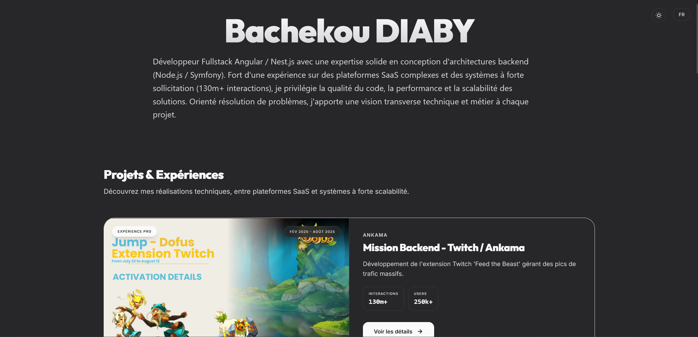

# Portfolio V2 - Bachekou DIABY

🌐 **[Voir le site en live → bdiaby.fr](https://bdiaby.fr)**

Bienvenue sur le dépôt de mon portfolio personnel (Version 2). Cette application est un showcase technique complet mettant en avant mes expériences, mes compétences et mes projets phares.



## Caractéristiques
- **Design Premium** : UI/UX moderne avec animations fluides (GSAP-like via CSS), typographie soignée (Inter & Outfit) et mode sombre optimisé.
- **Fullstack** : Architecture découplée avec un Frontend Angular performant et un Backend NestJS robuste.
- **Internationalisation (i18n)** : Support complet Français / Anglais.
- **Déploiement Pro** : Docker + Nginx + HTTPS (Certbot) sur Oracle Cloud Free Tier.

## Tech Stack

### Frontend
- **Angular 19+**
- **Tailwind CSS v4**
- **Angular Signals**

### Backend
- **NestJS**
- **Swagger/OpenAPI**
- **Jest/Supertest**

### DevOps
- **Docker & Docker Compose**
- **Oracle Cloud** *(Free Tier)*
- **Nginx** + **Certbot**

## Installation locale
```bash
git clone https://github.com/Bachekou-DIABY/portfolio_V2.git
cd portfolio_V2
```

**Backend :**
```bash
cd backend && npm install && npm run start:dev
```

**Frontend :**
```bash
cd frontend && npm install && npm run start
```

- Frontend : `http://localhost:4200`
- API / Swagger : `http://localhost:3000/api`

## Déploiement Production
```bash
docker compose up -d --build
```

---
Réalisé par **[Bachekou DIABY](https://bdiaby.fr)**